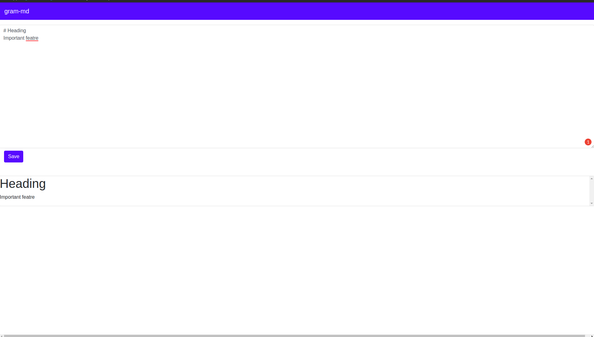

## gram-md

Personal Hack to use grammarly when editing `.md` files for docs.

download binary from [realeases](https://github.com/scriptonist/gram-md/releases)

rename the binary to `gram-md`

run `gram-md <filename>` to edit file in browser (with gramarly installed)

